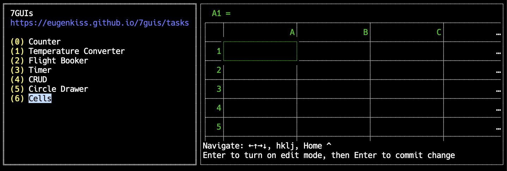
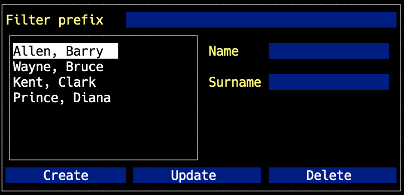

# TUI implementation in Go of 7GUIs task

See https://eugenkiss.github.io/7guis/tasks for the descriptions of each task.

## About

- This project is for learning [`tview`](https://github.com/rivo/tview) and
  building TUI apps only. **The code is neither optimized nor truely correct**.

- Keyboard shortcuts navigation is pretty non-standard. Please don't expect `Tab`,
  `Shift-Tab` and work as usual. Most of the time, `Tab` and `Shift-Tab` switch
  betweent the sidebar and the widget view. Mouse control should works as
  expected (albeit rather laggy) for input fields, slider and buttons.

## Demo



See demos in [`./media`](./media) folder if the content below isn't playable.

### Counter

https://user-images.githubusercontent.com/8386780/178098866-e6c387ea-9be3-452d-b026-ef41519b7722.mp4

### Temperature Converter

https://user-images.githubusercontent.com/8386780/178098884-d4474cc5-f4a3-4544-bb29-abc24520c37f.mp4

### Flight Booker

https://user-images.githubusercontent.com/8386780/178098889-e8eb0be7-beca-45d2-b059-6087ea7e8fbf.mp4

### Timer

https://user-images.githubusercontent.com/8386780/178098891-874489ef-1c9e-42c7-8168-0640233a97c0.mp4

### CRUD



### Circle Drawer

https://user-images.githubusercontent.com/8386780/178098899-25b455e1-552e-40bb-add7-a74b27011c19.mp4

### Cells

https://user-images.githubusercontent.com/8386780/178098904-437d2970-99fe-4424-b80b-57a46f16f45b.mp4

## Run

This project requires go version 1.13 or higher to use go modules. If you clone
the source locally, then just run it via:

```sh
$ go run .
```

If you have go1.17 or higher, which support `install` command, you can install
the demo and run via:

```sh
$ go install github.com/letientai299/7guis/tui@latest
$ tui
```

The application is not supposed to be useful, so, you might want to remove the
installed binary after play around with it.

```sh
$ rm $GOPATH/bin/tui
```

## Developing tips

For quick edit and review loop, use `nodemon` to watch for code change, rebuild
and restart the application via:

```sh
$ nodemon -w . -e .go -x './restart.sh'
```

## Lesson learned

- `tview.Form` overrides each input fields style. Hence, after Temperature
  Converter, for other form component, I rather use the field directly to
  support color changes during validation.

- `tview` doesn't have a reactive system, hence, it's very painful to implement
  these exercises in it. Or, perhaps I'm just too stupid to figure out the
  correct way to implement them.
